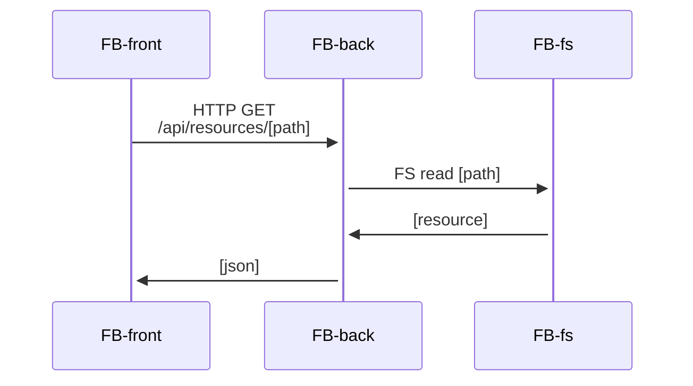
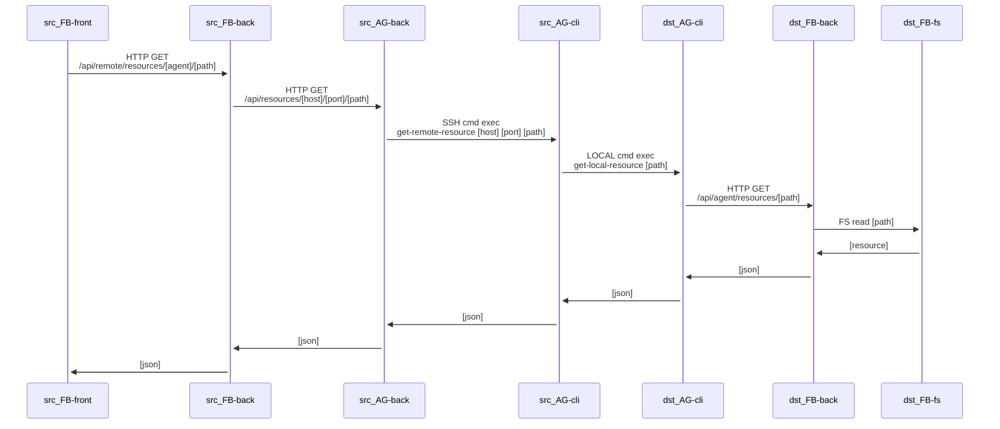

## Get resources (directory listing)

**local**

```mermaid
sequenceDiagram
    FB-front->>+FB-back: HTTP GET<br>/api/resources/[path]
    FB-back->>+FB-fs: FS read [path]
    FB-fs->>+FB-back: [resource]
    FB-back->>+FB-front: [json]
```

**remote**

```mermaid
sequenceDiagram
    src_FB-front->>+src_FB-back: HTTP GET<br>/api/remote/resources/[agent]/[path]
    src_FB-back->>+src_AG-back: HTTP GET<br>/api/resources/[host]/[port]/[path]
    src_AG-back->>+src_AG-cli: SSH cmd exec<br>get-remote-resource [host] [port] [path]
    src_AG-cli->>+dst_AG-cli: LOCAL cmd exec<br>get-local-resource [path]
    dst_AG-cli->>dst_FB-back: HTTP GET<br>/api/agent/resources/[path]
    dst_FB-back->>+dst_FB-fs: FS read [path]
    dst_FB-fs->>+dst_FB-back: [resource]
    dst_FB-back->>+dst_AG-cli: [json]
    dst_AG-cli->>+src_AG-cli: [json]
    src_AG-cli->>+src_AG-back: [json]
    src_AG-back->>+src_FB-back: [json]
    src_FB-back->>+src_FB-front: [json]
```
